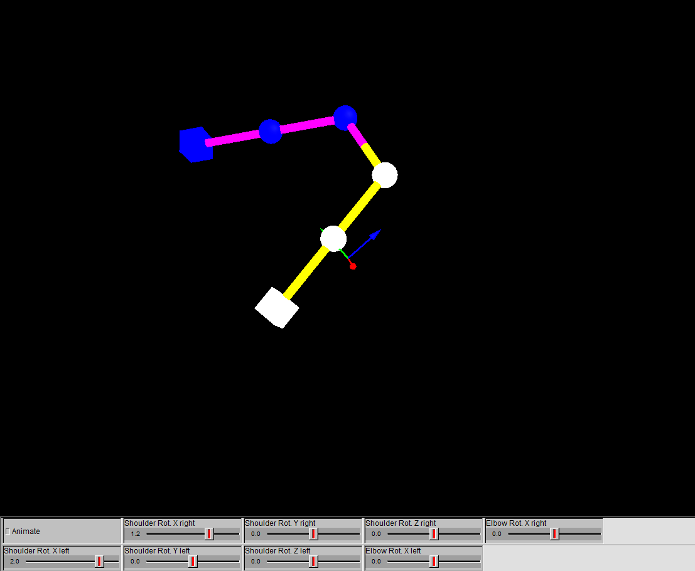

# Conformal-Geometrcal-Algebra-Final-Partial

## Objective

Animate a body skeleton using Conformal Geometrical Algebra (CGA). This project demonstrates how to represent and manipulate geometric entities (points, spheres, planes, lines, circles, etc.) and animate a kinematic structure (such as a skeleton) using the tools of CGA.

## Implementation Details

The main animation logic is implemented in [`main.clu`](main.clu). The code uses Conformal Geometric Algebra (CGA) to represent and animate a human skeleton, on the legs and pelvis (so far). The animation is driven by data loaded from `data.dat`, which contains the pose information for an animation of 602 frames.

Screenshots of the animation are provided below, of the legs part:

Screenshots of the animation are provided below, of the arms part:

### Key Components

- **Global Motor Calculation:**  
  The global position and orientation of the skeleton are set using translation and rotation motors, applied to the origin.

- **LegFromPelvis Function:**  
  This function constructs and animates a leg (left or right) from the pelvis using a kinematic chain:
  - **Pelvis, Knee, and Foot Rotations:**  
    Each joint's rotation is read from the frame data and can be interactively adjusted with sliders.
  - **Bone Construction:**  
    The femur and tibia are represented as cylinders, and the foot as a box. Spheres are used to visualize the joints.
  - **Side Selection:**  
    The function can animate either the left or right leg, with color coding for each side.

- **ArmFromSternum Function (Stub):**  
  A placeholder for future implementation of arm animation.

- **Leg Placement:**  
  The left and right legs are positioned relative to the pelvis using translation motors.

### Animation Controls

- **Sliders:**  
  Sliders allow interactive adjustment of joint angles for pelvis, knee, and foot rotations.
- **Checkbox:**  
  The "Animate" checkbox enables or disables animation playback.

### Data

- **Input Data:**  
  The file `data.dat` contains the animation frames, with each row representing a pose.

### Visualization

- **Geometric Primitives:**  
  - Cylinders: Represent bones (femur, tibia)
  - Spheres: Represent joints (pelvis, knee)
  - Box: Represents the foot

### Extensibility

- The code is modular, allowing for easy extension to other body parts (e.g., arms, torso).
- Additional geometric primitives and kinematic chains will be added soon.

---

For more details, see the comments in [`main.clu`](main.clu).

## Made With

- **CluViz v7.0.26.0**

## Files

- [`main.clu`](main.clu): Main script with geometric primitives, animation logic, and examples.
- [`defines.clu`](defines.clu): Definitions of constants.
- [`functions.clu`](functions.clu): Tools for creating and manipulating geometric entities.

## Usage

1. Open [`main.clu`](main.clu) in your preferred CGA-compatible environment.
2. Run the script to visualize and animate the skeleton.
3. Use the provided sliders and controls to interact with the animation.

## Author

Niels Ouvrard

Carlos Jimenez

Pablo Raschid Llamas Aun
